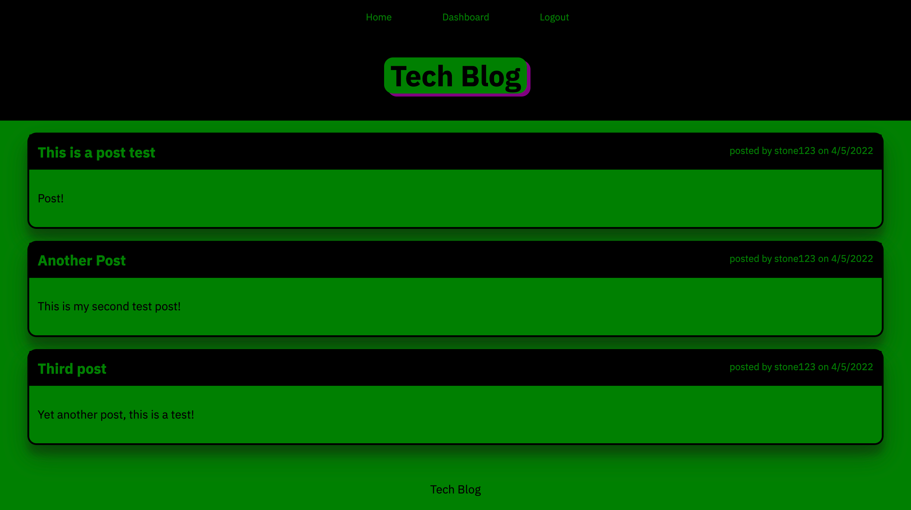

# Tech Blog

## About
This is a simple tech blog application, made with HTML, CSS, and Javascript. It also uses various NPM packages.  
The user is able to create an account, view blog posts, post their own posts, update and delete posts, as well as post, update, and delete comments.

## Packages Used
    Bcrypt
    Connect-Session-Sequelize
    DotEnv
    Express
    Express-Handlebars
    Express-Session
    Mysql2
    Sequelize

## Screenshot

## Links
[Deployed App](https://stone-hw-14-tech-blog.herokuapp.com/)  
[GitHub Repo](https://github.com/stone-com/Week-14-Tech-Blog)

